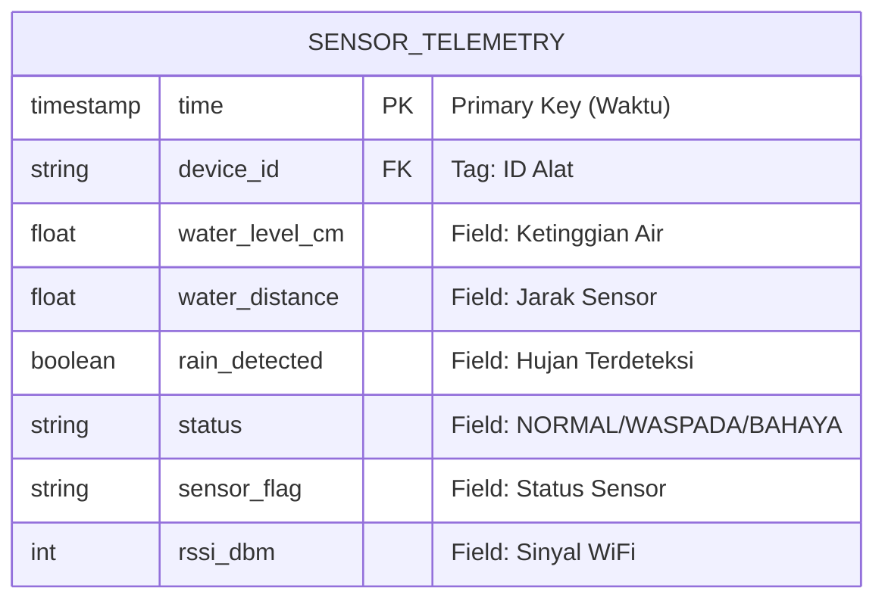
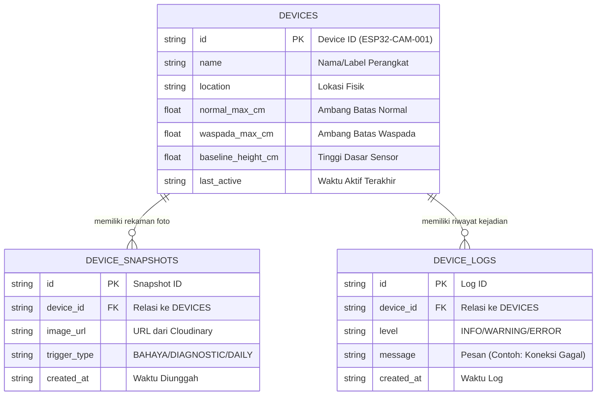

# Technical Design & Implementation Plan: IoTDrainage-BE

**Status:** Draft / Active
**Target System:** `IoTDrainage-BE` (Golang/Fiber)
**Integration Target:** `iot-drainage` (ESP32-CAM Sistem Deteksi Dini Banjir Firmware)

---

## 1. Executive Summary
Dokumen ini merupakan panduan teknis (*Technical Design Document*) bagi Backend Developer untuk melakukan sinkronisasi arsitektur `IoTDrainage-BE` dengan spesifikasi terbaru dari *sistem deteksi dini banjir*. Fokus utama pembaruan meliputi perubahan rute komunikasi MQTT, penambahan endpoint manajemen perangkat, pembaruan skema WebSocket, dan integrasi notifikasi kritis (FCM).

---

## 2. Architecture & Communication Flow
Sistem deteksi dini banjir pada ESP32 menggunakan model **MQTT-First** untuk operasional dan manajemen konfigurasi. 
*   **HTTP REST** digunakan khusus untuk komunikasi App Android ↔ Backend dan transmisi file besar (Upload Foto dari ESP32).
*   **MQTT** digunakan oleh ESP32 untuk Telemetri, menerima Perintah Manajemen (*Command*), dan Diagnostik.
*   **WebSocket** digunakan murni secara pasif (Satu arah: Backend → App Android) untuk meneruskan data telemetri real-time.

### 2.1. Skema InfluxDB (Time-Series Data)
Basis data khusus untuk menampung riwayat metrik yang datang secara kontinu (*append-only*) dari perangkat IoT.



### 2.2. Skema Firebase / Relational DB (Master Data & Config)
Basis data transaksional/dokumen untuk memelihara wujud terkini profil perangkat, pengaturan sensitivitas (threshold), serta daftar log/foto.



---

## 3. MQTT Specification & Integration

### 3.1. Telemetry Data (Subscribe)
Backend harus melakukan *subscribe* untuk menerima data rutin dari ESP32.
*   **Topic:** `compro9.26.telyu-iot-drainage-be/sensor-data`
*   **Action:** 
    1. Simpan metrik ke dalam InfluxDB (atau TSDB pilihan).
    2. Broadcast payload ke WebSocket *room* yang sesuai dengan `device_id`.
    3. Jika `status == "BAHAYA"`, *trigger* layanan Push Notification (FCM).
*   **Expected Payload:**
    ```json
    {
      "device_id": "ESP32-CAM-001",
      "water_level_cm": 34.5,
      "water_distance": 115.5,
      "rain_detected": false,
      "status": "NORMAL",
      "sensor_flag": "OK",
      "rssi_dbm": -62,
      "time_synced": true,
      "timestamp": 1715612400
    }
    ```
    **Keterangan Atribut:**
    *   `device_id`: ID unik pengenal perangkat keras ESP32.
    *   `water_level_cm`: Ketinggian air riil dihitung dari dasar saluran (cm).
    *   `water_distance`: Jarak absolut yang dibaca sensor ultrasonik ke permukaan air.
    *   `rain_detected`: Penanda curah hujan (disediakan untuk ekspansi fitur hujan *boolean*).
    *   `status`: Status kondisi banjir yang dikalkulasi langsung oleh ESP32 (NORMAL / WASPADA / BAHAYA).
    *   `sensor_flag`: Indikator integritas nilai sensor (OK / ERROR / OUT_OF_RANGE).
    *   `rssi_dbm`: Kualitas dan kekuatan sinyal transmisi WiFi perangkat.
    *   `time_synced`: Menginformasikan apakah *timestamp* valid (tersinkron NTP server).
    *   `timestamp`: Waktu perekaman data di perangkat dalam format Unix Epoch (detik).

### 3.2. Diagnostic & Logs (Subscribe)
Guna keperluan monitoring kesehatan perangkat:
*   **Topic Diagnostic:** `device/+/diagnostic` (Menerima hasil diagnostik komprehensif sensor).
*   **Topic Log:** `device/+/log` (Menerima log aktivitas dari perangkat, misal: kegagalan WiFi).
*   **Topic Response:** `device/+/res` (Menerima konfirmasi berhasil/tidaknya sebuah *command* dieksekusi oleh ESP32).

### 3.3. Device Commands (Publish)
Backend wajib menyediakan mekanisme (*service layer*) untuk memublikasikan perintah (Command) ke ESP32.
*   **Topic:** `device/{device_id}/cmd`
*   **Supported Commands & Payload Examples:**
    
    > [!IMPORTANT]
    > **Keamanan Token (HMAC-SHA256)**
    > Setiap *command* yang dipublikasikan **WAJIB** menyertakan parameter keamanan agar tidak ditolak oleh ESP32 (*replay attack prevention*):
    > *   **`ts`**: Unix *timestamp* saat pengiriman (dalam detik).
    > *   **`token`**: String heksadesimal (huruf kecil) hasil dari hashing **HMAC-SHA256**. Gunakan `device_secret` sebagai HMAC Key, dan nilai `ts` (dalam format string) sebagai pesan yang di-*hash*.
    > 
    > *(Contoh Logika Pseudocode):*
    > ```text
    > ts_string = string(current_unix_timestamp)
    > hmac_obj = create_hmac(key = device_secret, algorithm = SHA256)
    > hmac_obj.update(ts_string)
    > token = hmac_obj.to_hex_lowercase()
    > ```

    **1. Set Threshold (`set_thresholds`)**
    Mengatur ambang batas ketinggian air secara dinamis.
    ```json
    {
      "cmd": "set_thresholds",
      "normal_max_cm": 40.0,
      "waspada_max_cm": 80.0,
      "baseline_height_cm": 150.0,
      "msg_id": "req-12345",
      "ts": 1715612400,
      "token": "a1b2c3d4e5f6... (HMAC-SHA256 dari device_secret + ts)"
    }
    ```

    **2. Masuk Mode Maintenance (`enter_maintenance`)**
    Memaksa ESP32 masuk ke Mode Maintenance untuk keperluan diagnostik/inspeksi fisik.
    ```json
    {
      "cmd": "enter_maintenance",
      "msg_id": "req-12346",
      "ts": 1715612405,
      "token": "b2c3d4e5f6..."
    }
    ```

    **3. Factory Reset & Reboot (`reboot_setup`)**
    Menghapus konfigurasi (NVS) dan mengembalikan alat ke Mode Commissioning (Access Point).
    ```json
    {
      "cmd": "reboot_setup",
      "msg_id": "req-12347",
      "ts": 1715612410,
      "token": "c3d4e5f6g7..."
    }
    ```

    **4. Ambil Foto Instan (`force_snapshot`)**
    Menyalakan kamera, mengambil foto saat itu juga, dan langsung mengunggahnya.
    ```json
    {
      "cmd": "force_snapshot",
      "msg_id": "req-12348",
      "ts": 1715612415,
      "token": "d4e5f6g7h8..."
    }
    ```

    **5. Jadwalkan Foto (`snapshot`)**
    Menjadwalkan pengambilan foto pada siklus bangun operasional berikutnya (hemat baterai).
    ```json
    {
      "cmd": "snapshot",
      "msg_id": "req-12349",
      "ts": 1715612420,
      "token": "e5f6g7h8i9..."
    }
    ```

    **6. Jalankan Diagnostik Sensor (`diagnostic`)**
    Menjadwalkan pembacaan ulang multi-sample sensor pada siklus bangun berikutnya.
    ```json
    {
      "cmd": "diagnostic",
      "msg_id": "req-12350",
      "ts": 1715612425,
      "token": "f6g7h8i9j0..."
    }
    ```

    **7. Ubah Kredensial WiFi (`update_wifi`)**
    Mengubah SSID dan password WiFi perangkat secara nirkabel lalu me-reboot perangkat.
    ```json
    {
      "cmd": "update_wifi",
      "ssid": "Jaringan_Baru",
      "pass": "PasswordKuat123",
      "msg_id": "req-12351",
      "ts": 1715612430,
      "token": "g7h8i9j0k1..."
    }
    ```

    **8. Atur Mode Flash Kamera (`set_flash_mode`)**
    Mengatur penggunaan lampu flash (LED) saat mengambil foto (Mendukung: `ON`, `OFF`, `AUTO`).
    ```json
    {
      "cmd": "set_flash_mode",
      "mode": "AUTO",
      "msg_id": "req-12352",
      "ts": 1715612435,
      "token": "h8i9j0k1l2..."
    }
    ```


---

## 4. REST API Specification

Beberapa *endpoint* baru / modifikasi dibutuhkan pada modul HTTP (Fiber):

| Method | Endpoint | Fungsi | Keterangan |
| :--- | :--- | :--- | :--- |
| `GET` | `/api/devices/:id/config` | Mengambil threshold saat ini | Diambil dari Database Backend untuk App Android. |
| `PUT` | `/api/devices/:id/config` | Update threshold perangkat | **Kritikal:** 1) Simpan ke DB. 2) Langsung publish pesan MQTT `set_thresholds` ke `device/{id}/cmd`. |
| `POST` | `/api/upload-image` | Upload foto saat Bahaya | Menerima form-data multipart (sudah terimplementasi sebagian, sesuaikan *form key*). |
| `POST` | `/api/devices/:id/snapshot`| Upload foto diagnostik | Simpan URL gambar dan relasikan ke *Device* di DB. |

*(Catatan: ESP32 **TIDAK** lagi memanggil method GET/PUT config. Rute config di atas hanya diakses oleh UI/App Android).*


