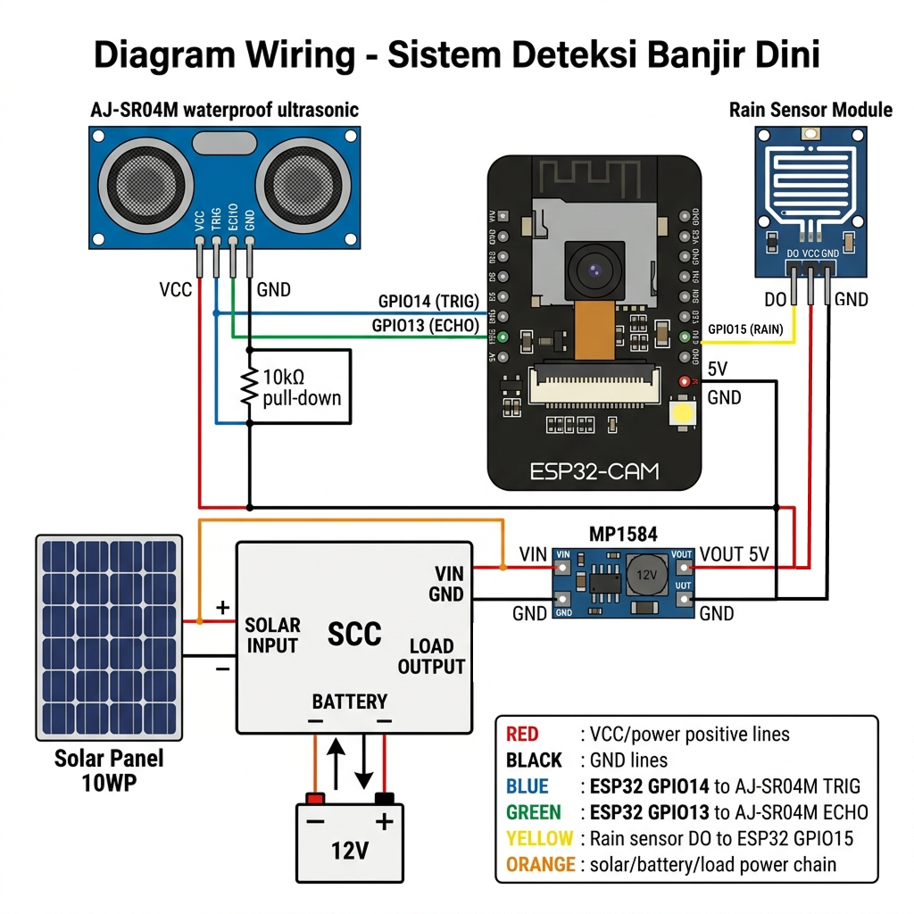

# Hardware Interface — Sistem Deteksi Banjir Dini

Dokumen ini menjelaskan antarmuka perangkat keras (*Hardware Interface*) pada Sistem Deteksi Banjir Dini, mencakup daftar perangkat yang digunakan, koneksi sensor, konektivitas IoT, serta manajemen daya.

---

## 1. Daftar Perangkat Keras

Berikut adalah komponen perangkat keras yang digunakan dalam sistem:

| No | Komponen | Model / Spesifikasi | Fungsi |
|----|----------|---------------------|--------|
| 1 | Mikrokontroler | ESP32-CAM AI-Thinker | Unit pemrosesan utama, modul WiFi terintegrasi, dan kamera |
| 2 | Sensor Jarak | AJ-SR04M (Ultrasonik, *waterproof*) | Mengukur ketinggian muka air pada saluran drainase |
| 3 | Sensor Hujan | Rain Sensor Module (Digital) | Mendeteksi kondisi hujan untuk mempercepat siklus pemantauan |
| 4 | Kamera | OV2640 (bawaan ESP32-CAM) | Menangkap gambar visual kondisi drainase secara berkala |
| 5 | Solar Panel | 10WP | Sumber energi utama untuk pengisian baterai |
| 6 | Solar Charge Controller (SCC) | PWM 12V/24V 10A, LCD Display + USB | Mengatur proses pengisian baterai dari solar panel |
| 7 | Baterai | 12V | Penyimpanan energi listrik |
| 8 | Step-down Converter | MP1584 | Menurunkan tegangan dari 12V ke 5V untuk menyuplai ESP32-CAM |

---

## 2. Koneksi Sensor ke Mikrokontroler

### 2.1 Sensor Ultrasonik (AJ-SR04M)

Sensor ultrasonik digunakan untuk mengukur jarak antara sensor dengan permukaan air. Sensor ini terhubung ke ESP32-CAM melalui dua pin:
- **Trigger**: Mengirimkan sinyal ultrasonik ke arah permukaan air.
- **Echo**: Menerima pantulan sinyal dan menghitung jarak berdasarkan waktu tempuh.

Dari jarak yang terukur, sistem menghitung ketinggian air menggunakan rumus:

> **Ketinggian Air = Tinggi Pemasangan Sensor − Jarak Terukur**

Sistem mengambil beberapa sampel pembacaan dalam satu siklus, kemudian menerapkan filter untuk menghasilkan nilai yang akurat dan stabil.

### 2.2 Sensor Hujan (Rain Sensor Module)

Sensor hujan mendeteksi keberadaan air hujan pada permukaannya. Sensor ini memberikan sinyal digital (ada hujan / tidak ada hujan) ke mikrokontroler. Selain itu, sensor hujan juga memiliki kemampuan khusus untuk **membangunkan perangkat dari mode tidur hemat daya** secara otomatis ketika hujan terdeteksi, sehingga sistem dapat segera melakukan pemantauan tanpa menunggu jadwal.

### 2.3 Kamera OV2640

Modul kamera OV2640 terintegrasi langsung pada board ESP32-CAM. Kamera ini digunakan untuk mengambil foto kondisi drainase, yang kemudian diunggah ke server. Kamera dilengkapi dengan **LED flash** (GPIO 4) yang mendukung tiga mode pencahayaan yang dapat diatur via Web UI:
- **AUTO:** Lampu flash menyala secara cerdas hanya jika kondisi lingkungan terdeteksi gelap (berdasarkan analisis perbandingan kecerahan gambar).
- **Always ON:** Lampu flash selalu menyala saat pengambilan gambar (penanganan Brownout/Voltage drop dinonaktifkan sementara demi keamanan).
- **Always OFF:** Lampu flash dinonaktifkan sepenuhnya untuk menghemat daya baterai.

### 2.4 Diagram Wiring

Berikut adalah diagram hubungan koneksi antar komponen perangkat keras:



---

## 3. Konektivitas IoT

Perangkat berkomunikasi dengan server melalui beberapa protokol jaringan berikut:

### 3.1 WiFi

Perangkat terhubung ke jaringan WiFi untuk mengirimkan data ke server. Terdapat dua mode operasi WiFi:

- **Mode Station (STA)**: Perangkat terhubung ke jaringan WiFi yang tersedia (router/access point) untuk transmisi data sensor ke server.
- **Mode Access Point (AP)**: Perangkat memancarkan jaringan WiFi sendiri untuk keperluan konfigurasi awal. Pengguna dapat terhubung ke jaringan ini dan mengakses halaman pengaturan melalui *browser*.

### 3.2 MQTT (Message Queuing Telemetry Transport)

MQTT adalah protokol komunikasi ringan yang dirancang khusus untuk perangkat IoT. Pada sistem ini, MQTT digunakan untuk:

- **Mengirim data sensor** (telemetri) dari perangkat ke server secara berkala, meliputi ketinggian air, status drainase, kondisi hujan, dan kekuatan sinyal.
- **Menerima perintah** dari server ke perangkat, seperti mengubah pengaturan ambang batas, meminta foto, atau meminta perangkat masuk ke mode pemeliharaan.

Data dikirim dalam format **JSON** (JavaScript Object Notation) yang ringan dan mudah diproses oleh server.

### 3.3 HTTP (Hypertext Transfer Protocol)

Protokol HTTP digunakan khusus untuk **mengunggah foto** dari kamera ke server backend. Foto dikirim saat:
- Ketinggian air mencapai level **bahaya**.
- Jadwal pengambilan foto harian (snapshot) tiba.

### 3.4 NTP (Network Time Protocol)

NTP digunakan untuk **menyinkronkan waktu** perangkat dengan server waktu internet. Hal ini penting agar setiap data sensor yang dikirim memiliki *timestamp* (cap waktu) yang akurat.

---

## 4. Manajemen Daya

Sistem dirancang untuk beroperasi secara **mandiri (off-grid)** menggunakan energi matahari, sehingga efisiensi daya menjadi aspek yang sangat penting.

### 4.1 Sumber Daya

Alur suplai daya pada sistem:

```
Solar Panel (10WP) ──→ SCC ──→ MP1584 ──→ ESP32-CAM (5V)
                        ↕
                   Baterai 12V
```

Solar panel menyuplai energi matahari ke **Solar Charge Controller (SCC)** yang berperan sebagai pusat distribusi daya. SCC memiliki tiga terminal utama:
- **Input Solar**: Menerima daya dari solar panel.
- **Baterai**: Mengisi dan mengelola baterai 12V sebagai penyimpanan energi.
- **Output Load**: Menyalurkan daya ke modul **MP1584** yang menurunkan tegangan dari 12V menjadi 5V untuk menyuplai ESP32-CAM.

### 4.2 Mode Hemat Daya (Deep Sleep)

Untuk menghemat konsumsi baterai, perangkat menggunakan mode **Deep Sleep** di antara setiap siklus pemantauan. Dalam mode ini, hampir seluruh komponen elektronik dinonaktifkan sehingga konsumsi daya sangat rendah.

Interval waktu tidur menyesuaikan kondisi ketinggian air:

| Kondisi | Interval Pemantauan | Keterangan |
|---------|---------------------|------------|
| **Normal** | Setiap 60 menit | Kondisi aman, pemantauan jarang untuk hemat baterai |
| **Waspada** | Setiap 10 menit | Ketinggian air mulai naik, pemantauan lebih sering |
| **Bahaya** | Setiap 2 menit | Ketinggian air tinggi, pemantauan intensif |

### 4.3 Bangun Otomatis oleh Sensor Hujan

Selain bangun berdasarkan jadwal (*timer*), perangkat juga dapat **dibangunkan secara otomatis** oleh sensor hujan. Ketika hujan terdeteksi, perangkat segera aktif untuk melakukan pengukuran di luar jadwal reguler, memastikan data terkini tersedia saat kondisi cuaca berubah.
