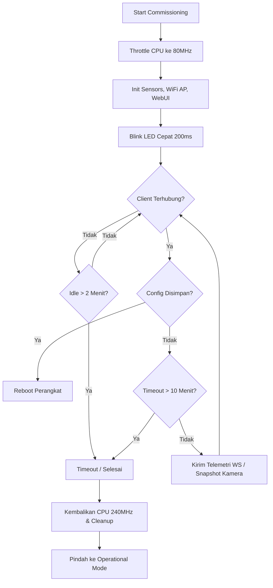
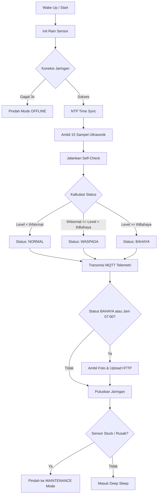
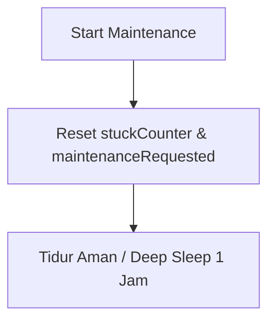

# Spesifikasi Protokol Data & Alur Sistem - IoTDrainage

Dokumen ini mendefinisikan arsitektur sistem, alur state-machine firmware, spesifikasi protokol uplink/downlink (MQTT), dan REST API HTTP berdasarkan codebase asli **IoTDrainage**. Dokumen ditujukan sebagai referensi bagi tim pengembang Firmware, Backend, dan Mobile App.

---

## Bab 1: PENDAHULUAN & ARSITEKTUR

Sistem **IoTDrainage** menggunakan ESP32-CAM (AI-Thinker) sebagai core processing unit. Arsitektur sistem mengadopsi _Clean Architecture_ dengan kapabilitas pengiriman data dual-channel:
1. **MQTT (Message Queuing Telemetry Transport)**: Digunakan untuk pengiriman data telemetri (sensor level air, curah hujan) secara satu arah (*Pure Publisher*).
2. **HTTP/REST API**: Digunakan khusus untuk transmisi payload yang berat seperti pengiriman foto/snapshot kondisi drainase ke server backend.

**Topologi & Perangkat Keras:**
- **Mikrokontroler**: ESP32-CAM AI-Thinker
- **Sensor Jarak/Air**: Ultrasonic AJ-SR04M (Pin Trig: 14, Pin Echo: 13)
- **Sensor Hujan**: Rain Sensor Module (Pin DO: GPIO 15, Active LOW, mengaktifkan deep sleep wake-up EXT0)
- **Kamera**: OV2640 dengan Flash LED (Pin 4) yang mendukung mode Auto, Always ON, atau Always OFF (dikonfigurasi via Web UI)
- **LED Indikator**: On-board Red LED (Pin 33)

---

## Bab 2: ALUR LOGIKA FIRMWARE (STATE MACHINE)

Firmware menggunakan model _State Machine_ dari saat _booting_ hingga _deep sleep_.

### A. Commissioning Mode
Mode ini aktif saat alat pertama kali dinyalakan (sebelum dikonfigurasi) atau saat dilakukan _factory reset_. Alat bertindak sebagai Access Point (AP) untuk konfigurasi awal via Web UI.



**Alur Commissioning:**
1. **CPU Throttling**: Menurunkan kecepatan CPU ke 80MHz untuk mencegah *overheating* (thermal mitigation) karena WiFi AP memakan banyak daya.
2. **Inisialisasi**: Menyalakan mode WiFi AP dan Web UI (Captive Portal). LED merah akan berkedip sangat cepat (200ms).
3. **Standby**: Alat menunggu klien tersambung. Jika tidak ada klien selama 2 menit, atau klien terhubung tapi tidak ada aksi sampai 10 menit, mode ini akan *timeout*.
4. **Interaksi Web UI**: Jika klien terhubung, alat mengirimkan data sensor (telemetri) per detik via WebSocket. Klien bisa meminta *preview* kamera.
5. **Penyimpanan Config**: Jika klien menyimpan pengaturan (SSID, Threshold, dll), alat akan *reboot* ke Operational Mode. Jika *timeout*, alat keluar dari mode commissioning dan paksa masuk Operational Mode dengan konfigurasi *default*.

### B. Operational Mode
Mode utama saat alat berfungsi memantau drainase. Dirancang secara spesifik agar _run-to-completion_ dengan pola hidup sebentar dan tidur lelap (_Deep Sleep_).



**Alur Operational:**
1. **Cek Rain Sensor**: Mengecek apakah modul terbangun dari _Deep Sleep_ karena interupsi sensor hujan (EXT0 pin 15).
2. **Koneksi Jaringan**: Terhubung ke WiFi lalu MQTT broker. Jika gagal dalam 3 percobaan, beralih ke mode **OFFLINE** (berjalan dengan _exponential backoff_).
3. **Time Sync**: Sinkronisasi waktu menggunakan NTP (pool.ntp.org).
4. **Pembacaan Sensor**: Membaca sensor ultrasonik dengan 15 sampel, lalu difilter menggunakan *median* dan *smoothing alpha* (0.4).
5. **Self-Check**: Mengecek validitas data (mendeteksi _spike_, _variance_ tinggi, atau tersangkut/stuck).
6. **Kalkulasi Status & Sleep Interval**:
   - `NORMAL`: Water Level < Threshold Normal (Default: 40cm). Waktu tidur 60 menit.
   - `WASPADA`: Threshold Normal <= Water Level < Threshold Bahaya (Default Normal: 40cm, Bahaya: 80cm). Waktu tidur 10 menit.
   - `BAHAYA`: Water Level >= Threshold Bahaya (Default: 80cm) atau ada *Force Bahaya*. Waktu tidur 2 menit.
7. **Transmisi UPLINK**: Mem-publish data sensor (telemetri) via MQTT dengan indikator lampu LED berkedip lambat satu kali (sukses).
8. **Manajemen Kamera**:
   - Jika status `BAHAYA`, kamera akan memotret dan melakukan HTTP POST ke backend. Jika gagal, akan di-flag untuk *retry* maksimal 5 kali pada siklus berikutnya.
   - Jika waktu menunjukkan pukul 07:00 pagi, ambil *Daily Snapshot* lalu kirim ke backend.
9. **Deep Sleep**: Memutuskan WiFi & MQTT secara *graceful*, menyimpan data status sementara di RTC Memory, lalu masuk ke status tidur lelap (*Deep Sleep*).

### C. Maintenance Mode
Mode darurat/pemeliharaan yang aktif secara otomatis ketika sistem mendeteksi kegagalan sensor (misalnya sensor terdeteksi stuck/membaca nilai konstan selama 5 siklus berturut-turut).



**Alur Maintenance:**
1. **Pembersihan Status:** Mengosongkan data eror (`maintenanceRequested = false`) dan me-reset penghitung sensor stuck (`stuckCounter = 0`) agar sistem bersih saat teknisi memeriksa alat secara fisik.
2. **Hibernasi Aman:** Memaksa mikrokontroler masuk ke mode *Deep Sleep* selama 1 jam (3600 detik) untuk mencegah sisa cadangan baterai terkuras habis ketika menunggu perbaikan dari petugas pemeliharaan. Setelah 1 jam, perangkat akan bangun kembali untuk mencoba operasi normal.

---

## Bab 3: SPESIFIKASI DATA UPLINK

Perangkat mempublikasikan data secara otomatis (_telemetry_) pada setiap siklus _wakeup_.

### A. Data Telemetri (Normal Operation)
- **Topic MQTT**: `compro9.26.telyu-iot-drainage-be/sensor-data`
- **QoS**: 1

**Kamus Data (Data Dictionary):**

| Key (JSON) | Tipe Data | Deskripsi & Contoh |
|---|---|---|
| `device_id` | String | ID Perangkat berbasis MAC Address (ex: `ESP32-1A2B3C`) |
| `location` | String | Lokasi perangkat yang dikonfigurasi via Web UI |
| `water_distance` | Float | Jarak mentah sensor ke permukaan air dalam sentimeter |
| `water_level_cm` | Float | Ketinggian air aktual terhitung |
| `status` | String | Keputusan status dari IoT: `"NORMAL"`, `"WASPADA"`, atau `"BAHAYA"` |
| `rain_detected` | Boolean | `true` jika hujan terdeteksi via EXT0 wake, `false` jika tidak |
| `sensor_flag` | String | Status diagnostik mandiri. Normal = `"OK"` |
| `timestamp` | Integer | Waktu Unix (_Unix Timestamp_ - UTC) saat data dikirim |
| `next_wakeup_sec` | Integer | _Dynamic Heartbeat_: Janji durasi (detik) alat akan tidur sebelum siklus berikutnya |

*(Catatan: Field IoT telah dimodifikasi untuk menjadikannya _Source of Truth_ status, sekaligus mengakomodasi _Offline Detection_ via Heartbeat dinamis di Backend).*

**Contoh Payload JSON (Uplink):**
```json
{
  "device_id": "ESP32-A1B2C3",
  "location": "Drainase_Sektor_Utara",
  "water_distance": 104.5,
  "water_level_cm": 45.5,
  "status": "WASPADA",
  "rain_detected": true,
  "sensor_flag": "OK",
  "timestamp": 1717645000,
  "next_wakeup_sec": 600
}
```

### B. HTTP POST (Upload Foto)
Kamera mem-bypass MQTT untuk upload gambar _snapshot_ atau _bahaya_.
- **Endpoint Foto Bahaya**: `POST http://<HOST>:<PORT>/api/image`
- **Endpoint Snapshot Harian**: `POST http://<HOST>:<PORT>/api/devices/{device_id}/snapshot`
*(Sistem backend harus siap menerima binary multipart form-data image/jpeg).*

---

## Bab 4: KONFIGURASI PERANGKAT & MANAJEMEN COMMAND

Berdasarkan pembaruan sistem terbaru, arsitektur IoT kini mengusung konsep **Pure Publisher**. Hal ini berarti:
- Perangkat **TIDAK LAGI** menerima atau mendengarkan command dari jarak jauh via MQTT (Downlink dihapus).
- Pemangkasan fitur command ini secara drastis meningkatkan efisiensi _Deep Sleep_, menghemat konsumsi daya baterai, serta menutup celah kerentanan memori dari pesan MQTT luar.

### Cara Mengubah Konfigurasi Alat
Karena _remote command_ telah ditiadakan, segala bentuk konfigurasi alat (perubahan WiFi, Lokasi, batas *threshold*) **harus** dilakukan secara fisik menggunakan fitur **Double Reset**:
1. Tekan tombol `RST` (atau pin reset) pada alat sebanyak **2 kali berturut-turut secara cepat**.
2. Alat akan melakukan _Factory Reset_ otomatis dan memancarkan WiFi (Access Point) untuk **Commissioning Mode**.
3. Buka Web UI alat dan masukkan konfigurasi yang baru.

---

## Bab 5: MANAJEMEN ERROR & DIAGNOSTIK

Firmware dilengkapi dengan logika **Progressive Fault Escalation** jika terjadi malfungsi sensor (ultrasonik kotor, sinyal memantul acak, atau macet):

- **> 2 Kali Error berturut-turut**: Flag peringatan -> `"SENSOR_UNSTABLE"`
- **> 4 Kali Error berturut-turut**: Memaksa masuk mode -> `"BAHAYA"` (_Force Bahaya_ untuk mitigasi terburuk)
- **> 10 Kali Error berturut-turut**: Perangkat di-pause. (Tidur lelap / Sleep selama 60 menit untuk mencegah kehabisan baterai).

### A. Daftar `sensor_flag` (Self-Check Diagnostic):
- `"OK"` : Sensor bekerja dengan baik.
- `"SENSOR_FAULT"` : Kesalahan generik/tidak terbaca.
- `"SENSOR_UNSTABLE"` : _Variance_ (deviasi sampel) > 50 cm². (Noise tinggi).
- `"SPIKE_DETECTED"` : Lonjakan perubahan jarak > 30 cm dalam satu siklus mendadak.
- `"SENSOR_STUCK"` : Nilai sensor tidak berubah selama 5 siklus.
- `"SENSOR_SUBMERGED"` : Permukaan air menempel pada sensor (Jarak dekat berlebihan).
- `"SENSOR_DISPLACED"` : Nilai _Baseline drift_ tinggi.


Jika gagal koneksi WiFi, firmware menerapkan _exponential backoff_ (Mode OFFLINE) untuk tidur:
- **Gagal 1-3x**: Retries tiap 5 menit (300 detik)
- **Gagal 4-6x**: Retries tiap 15 menit (900 detik)
- **Gagal 7-10x**: Retries tiap 60 menit (3600 detik)
- **Gagal >10x**: Retries tiap 6 jam (21600 detik)
